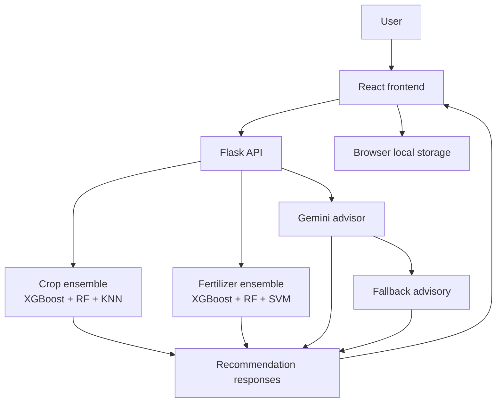

# CropWise AI

CropWise AI is a full-stack agricultural decision-support application built
with a React frontend and a Flask backend. It combines ensemble machine
learning models for crop and fertilizer recommendation with a Gemini-powered
AI advisor for region- and season-aware crop guidance.

## What the app includes

- Crop recommendation from soil nutrient and climate inputs
- Fertilizer recommendation from soil, crop, and environmental inputs
- AI crop advisor with English, Hindi, and Hinglish support
- AI follow-up chat for practical crop questions
- Gemini retry, failover, and local fallback handling
- Weather-assisted autofill
- Local browser storage for history, profile, and language preference
- Mobile-friendly UI polish for crop, fertilizer, and history flows

## Project structure

```text
project-root/
|-- Flask_API/
|   |-- app.py
|   |-- models/
|   |-- tests/
|   |-- requirements.txt
|   `-- .env.example
|-- React_Frontend/
|   `-- agri-ai/
|       |-- public/
|       |-- src/
|       |-- package.json
|       |-- vercel.json
|       `-- .env.example
|-- DATASET_AUDIT.md
`-- DEPLOYMENT.md
```

## Architecture at a glance



## Tech stack

- Frontend: React, Axios, React Router
- Backend: Flask, Flask-CORS, Gunicorn
- ML: scikit-learn, XGBoost, joblib, NumPy
- AI: Google Gemini API
- Styling: custom CSS

## Security essentials

- Keep `GEMINI_API_KEY` and `OPENWEATHER_API_KEY` in backend env only
- Keep real `.env` files out of Git; commit only `.env.example`
- Production CORS should allow only the deployed frontend origin
- AI routes always return either live or fallback metadata instead of raw provider failures
- Browser storage is limited to profile, language, and prediction history
- Oversized request bodies are rejected and high-traffic routes are rate-limited

## Dependency status and upgrade path

Current low-risk cleanup already applied:

- removed unused frontend dependencies:
  - `@material-ui/lab`
  - `cors` (frontend package)
  - `web-vitals`
- kept `font-awesome` because it is still imported

Recommended next upgrade path:

1. move from `react-scripts@4` to a modern toolchain when time allows
2. upgrade `axios@0.21.1` to a current maintained release after verifying API wrappers
3. review `react-router-dom@5` migration cost before upgrading to v6+
4. remove `@material-ui/core` only after confirming old unused UI files are gone

## Core modules

### 1. Crop recommendation

Inputs:

- Nitrogen
- Phosphorous
- Potassium
- Temperature
- Humidity
- Soil pH
- Rainfall

Outputs:

- `xgb_model_prediction`
- `rf_model_prediction`
- `knn_model_prediction`
- model probability scores
- `final_prediction`

### 2. Fertilizer recommendation

Inputs:

- Temperature
- Humidity
- Moisture
- Soil Type
- Crop Type
- Nitrogen
- Potassium
- Phosphorous

Outputs:

- `xgb_model_prediction`
- `rf_model_prediction`
- `svm_model_prediction`
- model probability scores
- `final_prediction`

### 3. AI crop advisor

Inputs:

- location or district
- season: `Kharif`, `Rabi`, or `Zaid`
- language: `English`, `Hindi`, or `Hinglish`

Outputs:

- top 3 crop suggestions
- practical reasons
- confidence level
- season fit
- water need
- soil type
- response metadata showing live or fallback mode

### 4. AI follow-up chat

After AI recommendations, users can ask follow-up questions such as:

- irrigation planning
- intercropping
- market demand
- pest-related concerns

Follow-up replies also return response metadata so the UI can distinguish
between live Gemini responses and fallback guidance.

## API endpoints

Base URL in local development:

```text
http://127.0.0.1:5000
```

Available routes:

- `GET /`
- `GET /health`
- `POST /predict_crop`
- `POST /predict_fertilizer`
- `POST /ai-recommend`
- `POST /ai-follow-up`
- `GET /weather`

### Example crop recommendation response

```json
{
  "xgb_model_prediction": "rice",
  "rf_model_prediction": "rice",
  "knn_model_prediction": "rice",
  "xgb_model_probability": 99.2,
  "rf_model_probability": 99.3,
  "knn_model_probability": 99.5,
  "final_prediction": "rice"
}
```

### Example fertilizer recommendation response

```json
{
  "xgb_model_prediction": "Urea",
  "rf_model_prediction": "Urea",
  "svm_model_prediction": "Urea",
  "xgb_model_probability": 99.2,
  "rf_model_probability": 99.3,
  "svm_model_probability": 99.5,
  "final_prediction": "Urea"
}
```

### Example AI recommendation response

```json
{
  "items": [
    {
      "crop": "Wheat",
      "reason": "Fits cool Rabi conditions and fertile alluvial soil.",
      "confidence": "High",
      "season_fit": "Perfect fit",
      "water_need": "Medium",
      "soil_type": "Alluvial, Loamy"
    }
  ],
  "meta": {
    "mode": "live",
    "source": "gemini",
    "warning_code": null
  }
}
```

### Example AI follow-up response

```json
{
  "reply": "Wheat is usually better grown as a dedicated crop in this context.",
  "meta": {
    "mode": "fallback",
    "source": "local",
    "warning_code": "live_service_unavailable"
  }
}
```

## Local setup

### Frontend

```powershell
cd React_Frontend\agri-ai
copy .env.example .env
npm install
npm start
```

Default frontend URL:

```text
http://localhost:3000
```

### Backend

Recommended Python runtime:

```text
Python 3.11
```

```powershell
cd Flask_API
py -3.11 -m venv .venv
.\.venv\Scripts\Activate.ps1
copy .env.example .env
pip install -r requirements.txt
python app.py
```

Default backend URL:

```text
http://127.0.0.1:5000
```

### Environment variables

#### Frontend (`React_Frontend/agri-ai/.env`)

```env
REACT_APP_API_BASE_URL=http://127.0.0.1:5000
```

#### Backend (`Flask_API/.env`)

```env
GEMINI_API_KEY=your_backend_only_gemini_api_key
GEMINI_MODEL=gemini-2.5-flash
GEMINI_FALLBACK_MODELS=gemini-2.5-flash-lite,gemini-2.0-flash
GEMINI_HTTP_REFERER=http://localhost:3000/
CORS_ALLOWED_ORIGINS=http://localhost:3000,http://127.0.0.1:3000
OPENWEATHER_API_KEY=your_backend_only_openweather_api_key
```

## Verification commands

### Backend tests

```powershell
cd Flask_API
.\.venv\Scripts\python.exe -m unittest discover -s tests -p "test_*.py" -v
```

### Backend compile check

```powershell
cd Flask_API
python -m py_compile app.py
```

### Frontend production build

```powershell
cd React_Frontend\agri-ai
npm run build
```

## Deployment summary

Recommended free hosting setup:

- frontend on Vercel
- backend on Render

For the full deployment checklist, see [DEPLOYMENT.md](C:\Users\HP\Downloads\AgriAI_WebApp-main\AgriAI_WebApp-main\DEPLOYMENT.md).

### Deployment smoke checklist

- frontend loads on `/`
- `/crop`, `/fertilizer`, and `/history` survive refresh
- backend `GET /health` returns `{"status":"ok"}`
- backend `GET /weather?city=Delhi` returns weather data without exposing the API key
- AI advisor returns either `meta.mode = "live"` or `meta.mode = "fallback"`

Quick checks:

```powershell
curl http://127.0.0.1:5000/health
curl "http://127.0.0.1:5000/weather?city=Delhi"
```

### Vercel frontend

- Project root: `React_Frontend/agri-ai`
- Build command: `npm run build`
- Output directory: `build`
- Required env var: `REACT_APP_API_BASE_URL=https://your-render-backend-url`

This repo includes `vercel.json` so React Router routes continue to work after
refresh.

### Render backend

- Project root: `Flask_API`
- Build command: `pip install -r requirements.txt`
- Start command: `gunicorn app:app --bind 0.0.0.0:$PORT`
- Health check path: `/health`

Required backend env vars:

- `GEMINI_API_KEY`
- `GEMINI_MODEL`
- `GEMINI_FALLBACK_MODELS`
- `GEMINI_HTTP_REFERER`
- `CORS_ALLOWED_ORIGINS`
- `OPENWEATHER_API_KEY`

## Practical notes

### AI reliability

If Gemini returns `429` or `503`, the backend does not fail immediately:

- it retries temporary overload cases
- it can fail over to backup Gemini models
- it falls back to local crop guidance when live AI still does not succeed

### Weather security

OpenWeather access is handled through the backend. The frontend no longer needs
or exposes a weather API key.

### Production-ready academic prototype checklist

This repo now aims to be a stable academic prototype rather than a loose demo.
Before presenting or deploying, make sure these still hold:

- frontend build passes
- backend tests pass
- frontend smoke tests pass
- backend env vars are set correctly
- `GET /health` responds cleanly
- AI advisor falls back gracefully when live Gemini is unavailable
- report/data folders are not mixed into app-only commits unless intentional

### Browser support

- AI advisor works best in modern Chromium-based browsers
- voice input depends on Web Speech API support
- if voice input misbehaves in Brave, Chrome or Edge usually works better

## Project support files

- Dataset notes: [DATASET_AUDIT.md](C:\Users\HP\Downloads\AgriAI_WebApp-main\AgriAI_WebApp-main\DATASET_AUDIT.md)
- Deployment guide: [DEPLOYMENT.md](C:\Users\HP\Downloads\AgriAI_WebApp-main\AgriAI_WebApp-main\DEPLOYMENT.md)

## Attribution

This project is a modified derivative of the open-source GitHub repository
[`venugopalkadamba/AgriAI_WebApp`](https://github.com/venugopalkadamba/AgriAI_WebApp).

The current version includes substantial changes to branding, documentation,
frontend experience, AI-assisted advisory behavior, validation, and fallback
handling while retaining parts of the original project structure and
recommendation workflow.

## License

This repository retains the `GPL-3.0` license from the original base project.
If you distribute this project or modified versions of it, continue to comply
with the terms of `GPL-3.0`. See the `LICENSE` file for details.
